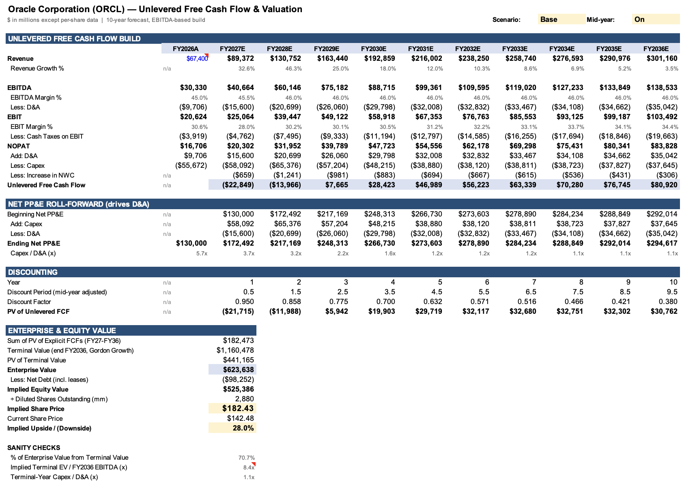

# Oracle (ORCL) — Discounted Cash Flow Valuation

A 10-year unlevered DCF model of Oracle Corporation built in Excel, with bear/base/bull scenarios, a PP&E roll-forward that ties depreciation to Oracle's AI data-center buildout, and two sensitivity tables.

**Base case: $182.43 implied share price vs. $142.48 close on Oct 5, 2026 (~28% upside).**
The scenario range is wide ($75 to $266), and that spread is the main finding: Oracle's value depends on whether its AI infrastructure spending converts into cash flow.

> Personal educational project, not investment advice.

---

## Valuation summary

| Scenario | Implied price | vs. $142.48 | % of EV from terminal value |
|---|---|---|---|
| Bear | $74.64 | (47.6%) | 74% |
| **Base** | **$182.43** | **+28.0%** | **71%** |
| Bull | $266.28 | +86.9% | 70% |

All three use the same WACC (10.7%), terminal growth (3.5%) and mid-year convention. Only revenue growth (FY27–FY31) and EBITDA margins change between scenarios.

---

## The investment question

Oracle spent about $55.7B on capex in FY2026, roughly 83% of its $67.4B revenue, to build AI and cloud data-center capacity. Free cash flow went negative. The bull case says a ~$523B backlog of contracted revenue turns that spending into a much larger, profitable cloud business. The bear case says growth slows, margins compress as lower-margin GPU rental grows, and the company is left carrying heavy debt.

The model is built to make that trade-off explicit. Base-case free cash flow is negative in FY27 and FY28 and only turns strongly positive once capex intensity falls.

| ($mm) | FY27E | FY28E | FY29E | FY30E | FY31E | FY36E |
|---|---|---|---|---|---|---|
| Revenue | 89,372 | 130,752 | 163,440 | 192,859 | 216,002 | 301,160 |
| Unlevered FCF | (22,849) | (13,966) | 7,665 | 28,423 | 46,989 | 80,920 |

---

## Methodology

**1. Free cash flow build (EBITDA-based).**
Revenue × EBITDA margin = EBITDA. EBITDA − D&A = EBIT. EBIT is taxed at 19% to get NOPAT. NOPAT + D&A − capex − change in working capital = unlevered free cash flow.

**2. D&A from a PP&E roll-forward.**
Instead of assuming D&A as a percentage of revenue, D&A is 12% of beginning net PP&E. Each year's capex adds to PP&E and D&A reduces it. That way the capex wave automatically raises future depreciation, rather than the two being set independently.

**3. 10-year forecast with a growth fade.**
FY27–FY28 follow Street consensus. FY29–FY31 decelerate as the backlog is worked through. FY32–FY36 fade linearly to the 3.5% terminal rate, so the terminal year reflects a mature business rather than one still mid-buildout.

**4. Discount rate (WACC = 10.7%).**

| Input | Value | Basis |
|---|---|---|
| Risk-free rate | 5.3% | [10-year Treasury (FRED DGS10)](https://fred.stlouisfed.org/series/DGS10), ~5.2% in late Sept 2026 |
| Equity risk premium | 4.20% | [Damodaran implied ERP](https://pages.stern.nyu.edu/~adamodar/), as of Oct 1, 2026 |
| Levered beta | 1.73 | High end of 2026 vendor betas (~1.26–1.72); conservative |
| Cost of equity (CAPM) | 12.6% | 5.3% + 1.73 × 4.20% |
| Pre-tax cost of debt | 6.0% | Approximate; S&P rated ORCL BBB- in July 2026 |
| Tax rate | 19% | Approximate effective rate |
| Weights (market values) | 76% equity / 24% debt | $410B market cap, $130B debt |

**5. Terminal value.**
Gordon growth on FY36 free cash flow at 3.5%. Mid-year convention: cash flows are discounted at 0.5, 1.5 … 9.5 years, and the terminal value uses the final year's factor.

---

## Sensitivity

**Implied price: WACC vs. terminal growth**

| WACC \ g | 2.5% | 3.0% | 3.5% | 4.0% | 4.5% |
|---|---|---|---|---|---|
| 9.7% | $199 | $212 | $228 | $246 | $267 |
| 10.2% | $180 | $191 | $203 | $218 | $235 |
| **10.7%** | $162 | $172 | **$182** | $195 | $209 |
| 11.2% | $147 | $155 | $164 | $175 | $186 |
| 11.7% | $134 | $141 | $149 | $157 | $167 |

**Implied price: levered beta vs. terminal growth**

| Beta | WACC | 2.5% | 3.5% | 4.5% |
|---|---|---|---|---|
| 1.00 | 8.4% | $268 | $317 | $392 |
| 1.20 | 9.0% | $231 | $269 | $323 |
| 1.40 | 9.7% | $201 | $230 | $271 |
| 1.60 | 10.3% | $177 | $200 | $230 |
| **1.73** | **10.7%** | $162 | **$182** | $209 |

Beta is the single largest valuation lever in the model. Moving from 1.73 to 1.20 adds about $86 per share.

---

## Sanity checks built into the model

- **Terminal value share of EV: 71%.** That's high but typical for a company still in heavy investment. An earlier 5-year version was 95%, which is why the forecast was extended.
- **Implied terminal EV / FY36 EBITDA: 8.4x.** That's conservative relative to large-cap software and infrastructure peers, so the terminal value is not doing anything aggressive.
- **Terminal capex / D&A: 1.07x.** Reinvestment slightly exceeds depreciation, which is consistent with 3.5% perpetual growth.

---

## Key judgment calls

- **Operating leases are excluded from net debt.** Oracle reports about $30.2B of operating lease liabilities. Under US GAAP, operating lease cost is already deducted in EBITDA, so subtracting the liability as well would double-count it. The figure ($3,542mm current + $26,648mm non-current = $30,190mm at May 31, 2026) is from the lease note in Oracle's SEC filings.
- **Beta of 1.73** reflects Oracle's elevated 2026 volatility. A bottom-up beta built from unlevered peer betas would be the next refinement.
- **Capex tapers** from 65% of revenue in FY27 to 12.5% by FY36. The model is very sensitive to this path.
- **12% depreciation rate** implies roughly an 8-year average asset life, blending short-lived servers with long-lived buildings and land.

## Limitations

- Customer concentration in the AI backlog is not modeled explicitly. The bear case is the stand-in.
- Cost of debt is approximate rather than taken from the yield on Oracle's bonds.
- Share count is held flat. Buybacks and stock-based compensation are not modeled.
- Working capital is a simple 3%-of-incremental-revenue assumption.

---

## Using the model

Open `ORCL_DCF_Model.xlsx`. Blue cells are inputs, black cells are formulas, and yellow cells are the key switches.

| Tab | What's there |
|---|---|
| Assumptions & WACC | Market data, capital structure, WACC, scenario selector (C28), mid-year toggle (C30), scenario inputs |
| DCF Valuation | FCF build, PP&E roll-forward, discounting, equity bridge, sanity checks |
| Sensitivity | WACC × terminal growth and beta × terminal growth tables |

Every hardcoded input has a cell comment explaining its source or reasoning.

## Sources

| Data | Source |
|---|---|
| Revenue, shares, debt, cash, PP&E, leases, tax rate | [Oracle SEC filings (FY2026 10-K, Q1 FY2027 10-Q)](https://www.sec.gov/cgi-bin/browse-edgar?action=getcompany&CIK=0001341439&type=10-&dateb=&owner=include&count=40) |
| Equity risk premium | [Aswath Damodaran, NYU Stern](https://pages.stern.nyu.edu/~adamodar/) |
| Risk-free rate | [FRED, 10-Year Treasury (DGS10)](https://fred.stlouisfed.org/series/DGS10) |
| Share price ($142.48 close, Oct 5, 2026) and beta | [Google Finance, ORCL](https://www.google.com/finance/quote/ORCL:NYSE) |
| FY27–FY28 consensus revenue | [Yahoo Finance, ORCL analyst estimates](https://finance.yahoo.com/quote/ORCL/analysis/) |
| ~$523B RPO backlog | [Oracle Investor Relations](https://investor.oracle.com/home/default.aspx) |
| S&P BBB- downgrade (July 2026) | [Wall Street Journal, July 9, 2026](https://www.wsj.com/livecoverage/stock-market-today-dow-sp-500-nasdaq-07-09-2026/card/oracle-gets-credit-rating-downgrade-QkUs8plVb7BlZRnDwzi6) |

---

## About

<Carlos D'Trinidad · Finance student, University of Central Florida · LinkedIn link -->
